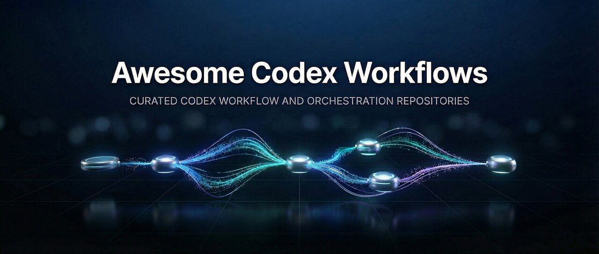

# Awesome Codex Workflows 

Curated resources for building and operating workflow-oriented development with Codex and Codex CLI.

This list focuses on repositories where Codex is a primary target and where the workflow itself is visible: orchestration, subagents, phase-based execution, worktree parallelism, review gates, quality gates, or related execution infrastructure.

It does not try to cover general AI coding tools, generic prompt collections, or Claude Code centered workflow systems unless they are useful as Codex-adjacent references.

## Contents

- [Inclusion Notes](#inclusion-notes)
- [Official Foundations](#official-foundations)
- [Codex-Native Workflow Frameworks](#codex-native-workflow-frameworks)
- [Codex Workflow Extensions](#codex-workflow-extensions)
- [Worktree / Session Infrastructure](#worktree--session-infrastructure)
- [Safety / Governance](#safety--governance)
- [Appendix: Cross-Agent Systems](#appendix-cross-agent-systems)

## Inclusion Notes

- Codex or Codex CLI should be an explicit primary target.
- The repository should expose a workflow or orchestration model, not only isolated skills or prompts.
- Reusable artifacts should exist, such as commands, agents, skills, templates, install scripts, or CLI tooling.
- Cross-agent systems are kept in the appendix when Codex is supported but not the main point of view.

<!-- GENERATED:REPO-LIST:START -->

## Official Foundations

- [OpenAI/codex](https://github.com/openai/codex) - Official Codex CLI repository and the base runtime for Codex-oriented workflows.
- [OpenAI/skills](https://github.com/openai/skills) - Official skill catalog for Codex, including reusable instructions, scripts, and resources.
- [agentsmd/agents.md](https://github.com/agentsmd/agents.md) - Open format for `AGENTS.md`, useful as a shared instruction-layer reference in the Codex workflow ecosystem.

## Codex-Native Workflow Frameworks

- [shinpr/codex-workflows](https://github.com/shinpr/codex-workflows) - End-to-end Codex CLI workflows built around specialized subagents, design artifacts, tests, and quality checks.
- [Yeachan-Heo/oh-my-codex](https://github.com/Yeachan-Heo/oh-my-codex) - Workflow layer for Codex CLI with staged execution, autopilot patterns, and parallel worktree-oriented development.

## Codex Workflow Extensions

- [feiskyer/codex-settings](https://github.com/feiskyer/codex-settings) - Codex configuration and workflow-oriented skills collection, including experimental skill-based development flows.

## Worktree / Session Infrastructure

- [milisp/codexia](https://github.com/milisp/codexia) - Agent workstation for Codex CLI with task scheduling, worktree management, remote control, and skills management.
- [xintaofei/codeg](https://github.com/xintaofei/codeg) - Multi-agent coding workspace with worktrees, session persistence, MCP management, and integrated Codex support.

## Safety / Governance

- [strongdm/leash](https://github.com/strongdm/leash) - Runtime containment and policy layer for AI coding agents, relevant to operating Codex workflows in controlled environments.

## Appendix: Cross-Agent Systems

These repositories are useful references, but Codex is not the main point of view.

- [catlog22/Claude-Code-Workflow](https://github.com/catlog22/Claude-Code-Workflow) - Multi-agent workflow framework with Codex support alongside other coding CLIs.
- [dsifry/metaswarm](https://github.com/dsifry/metaswarm) - Multi-agent orchestration framework that can delegate implementation and review work to Codex CLI.
- [stellarlinkco/myclaude](https://github.com/stellarlinkco/myclaude) - Multi-agent orchestration workflow where Codex can be used as an execution backend.

<!-- GENERATED:REPO-LIST:END -->

## Contributing

See [CONTRIBUTING.md](CONTRIBUTING.md).

Before proposing an addition, check that:

- Codex is a primary target, not only an optional backend.
- The repository shows an actual workflow or orchestration model.
- The project is public, accessible, and documented enough to evaluate.

For now, scope decisions should favor clarity over coverage.
